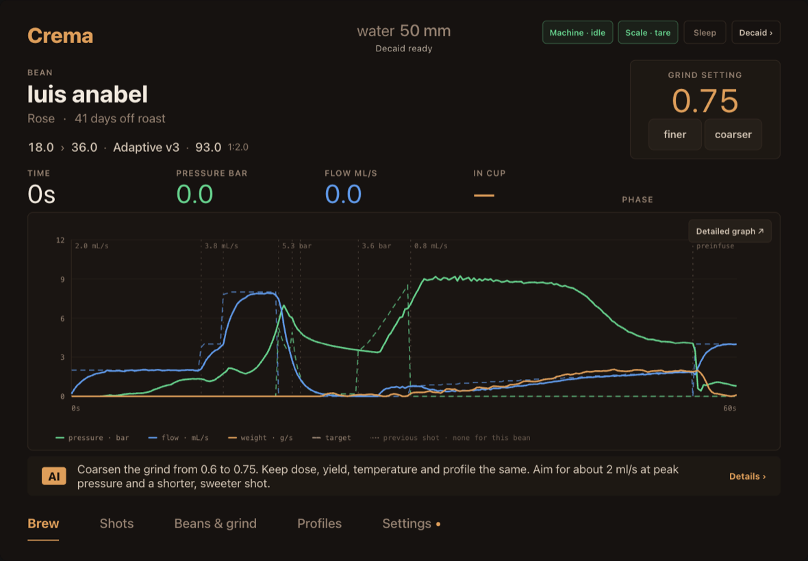
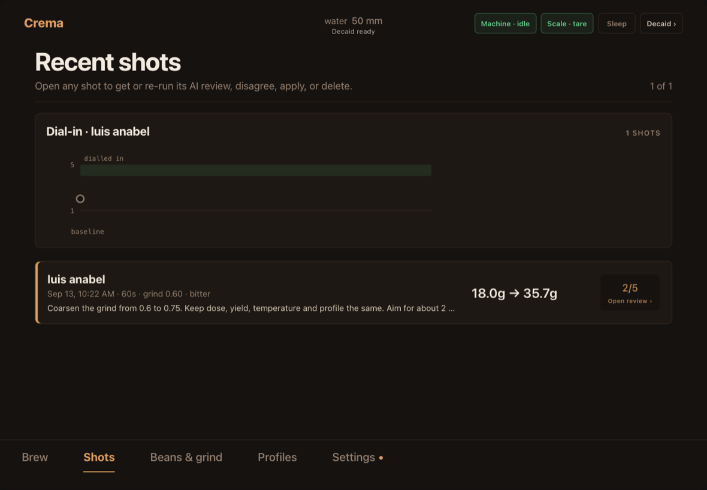
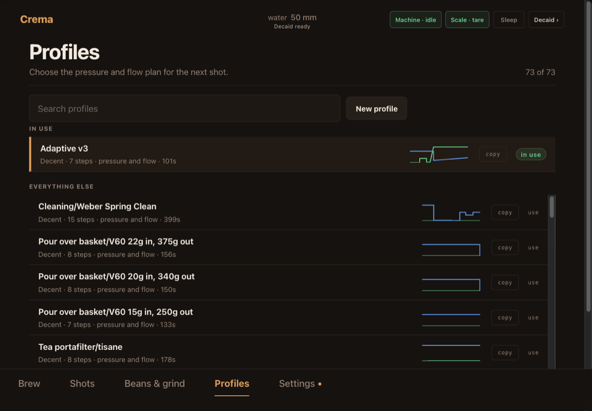
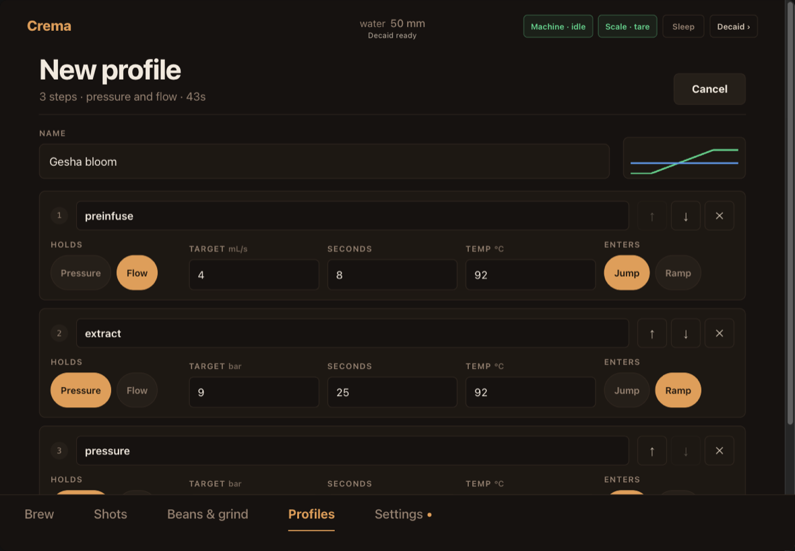
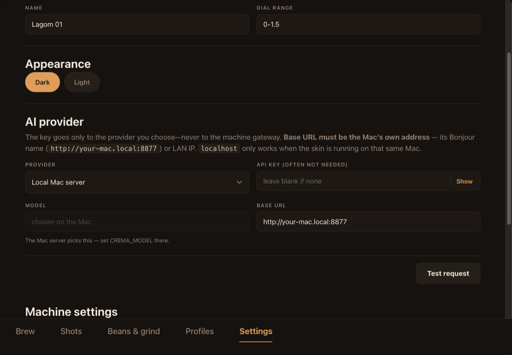

# Crema ☕

A skin for the [Decent DE1](https://decentespresso.com/) espresso machine that turns
every shot into a coaching session. Pull a shot, answer four taps about how it tasted,
and an AI barista reads your pressure/flow/weight curves and tells you exactly what to
change next — grind, dose, yield, temperature, or a whole new profile it writes and
applies for you in one tap.

You bring an API key from any major AI provider, or point Crema at a small server on
your own Mac so it runs on a Claude subscription instead of per-call billing. No
account, no telemetry, nothing leaves your network except the request you asked for.

> ⚠️ **Work in progress.** Crema is used daily on a real machine, but it's young and
> bugs still surface. If you hit one, please [open an issue](../../issues) — and if
> you'd like to help build it, see [Contributing](#contributing). PRs very welcome.

## Two editions, one repo

Decent ships two apps, so Crema comes in two builds. Both are maintained from this
tree and released together.

| | **Crema for Decaid** | **Crema Classic** |
|---|---|---|
| Runs on | [Decaid](https://github.com/decentespresso/decaid) — iPad, Android 9+, macOS, Windows, Linux | the classic `de1app` — the Android tablet your DE1 came with |
| Install | `Crema-Decaid.zip` | `Crema.zip` |
| Built from | [`web/`](web/) | [`skin/Crema/`](skin/Crema/) |
| Pick it if | you use Decaid, or an iPad | you use the tablet Decent shipped, including the Android 8.1 ones where Decaid cannot be installed at all |

Both do the same job and share the same advisor prompt. If you have a choice, use the
Decaid edition — it gets the newer work first.

## Crema for Decaid

<table>
  <tr>
    <td width="50%" valign="top"><br><sub><b>Brew.</b> The last shot's pressure, flow and weight against the profile's target, with the advice underneath. Hold anywhere on the graph to read exact values.</sub></td>
    <td width="50%" valign="top"><br><sub><b>Shots.</b> Every shot with its score and the advice you were given, over a dial-in trail that shows whether you are converging.</sub></td>
  </tr>
  <tr>
    <td width="50%" valign="top"><br><sub><b>Profiles.</b> Each row draws the plan it intends to execute, grouped by what you have actually brewed with.</sub></td>
    <td width="50%" valign="top"><br><sub><b>Profile editor.</b> Build or duplicate a profile by hand — what each step holds, at what target, for how long, and how hot.</sub></td>
  </tr>
  <tr>
    <td width="50%" valign="top"><br><sub><b>Setup.</b> Your grinder, a theme, and an AI provider. Settings save as you type them.</sub></td>
    <td width="50%" valign="top"></td>
  </tr>
</table>

### Install

1. In Decaid, open **Launcher → Skins → +** and choose **GitHub Release**.
2. Enter `yarneo/crema` and pick the asset **`Crema-Decaid.zip`**.
3. Choose **Crema** from the skin list.

> Do not install the repository's source archive — Decaid needs the built
> `Crema-Decaid.zip`, which has `index.html` and `manifest.json` at its root.

To install a local build instead, run `npm run release:zip` in [`web/`](web/) and use
**Launcher → Skins → + → ZIP file**.

### Set it up

Open **Settings** in Crema:

1. **Grinder** — its name (e.g. `Lagom 01`) and dial range (e.g. `0-1.5`). The advisor
   phrases every move in your grinder's own units, and looks the grinder up if it needs
   to.
2. **Appearance** — dark or light.
3. **AI provider** — pick one and paste its key, or choose **Local Mac server**
   ([below](#running-on-your-own-mac)). **Model** is a list of
   published model ids, so there is nothing to guess.
4. Tap **Test request** to confirm it answers.

Settings save as you leave each field; there is no Save button. Your key lives in this
device's browser storage and is sent only to the provider you chose — never to the
machine gateway.

### Pulling your first shot

Add the coffee in **Beans & grind**, then its bag with a roast date and roast level.
On **Brew** you will be offered a starting point: the advisor picks a grind, dose,
yield, temperature and profile for that bean before you have pulled anything. Pull the
shot, rate it in four taps, and from then on each shot gets one clear change.

## Crema Classic (the tablet DE1 ships with)

<table>
  <tr>
    <td width="33%" valign="top"><br><sub><b>1 · Pull a shot.</b> Calm home screen with your live graph, grind number, bean, and ratio.</sub></td>
    <td width="33%" valign="top"><br><sub><b>2 · Rate it in ~10s.</b> Four taps: taste, body, flow look, finish, and a 1–5 score.</sub></td>
    <td width="33%" valign="top"><br><sub><b>3 · Get one clear move.</b> A diagnosis plus the single highest-payoff change — tap <b>Apply</b>.</sub></td>
  </tr>
</table>

### Install

You need: a Decent DE1 with the standard Android tablet, and an API key from one AI
provider (see [Choosing a provider](#choosing-a-provider)).

1. **Get the skin.** Download `Crema.zip` from the
   [latest release](../../releases/latest) (or run `./build.sh` to make it yourself).
2. **Copy it to the tablet.** Unzip so you have a `Crema` folder, then put it in the
   DE1 app's `skins/` directory. The easy way, with the tablet in USB-debugging mode:
   ```bash
   adb push Crema /sdcard/de1plus/skins/Crema
   ```
   (Or copy the folder over with a USB stick / file manager — see [DEPLOY.md](DEPLOY.md).)
3. **Select it.** In the DE1 app: **Settings → App → Skin → Crema**, then restart the app.
4. **Run the setup wizard.** On first launch Crema asks for two things — your grinder
   and your AI provider + key. That's it. Pull a shot.

## What's new in v1.1.2

Two fixes to the classic tablet skin, both found on a real machine.

- **AI profiles no longer overwrite Decent's own profiles.** de1app saves a new
  profile into the file of whichever profile is loaded, and Crema saved with the
  previous one still loaded — so an AI profile for one bean could replace
  "Blooming Espresso" or "Adaptive v3". Each bean's AI profile now always saves
  to its own file. If a preset of yours shows an "AI · …" name, its original is
  kept inside that file as `read_only_backup` and can be restored.
- **Profiles no longer restarts the app.** Crema opened de1app's profile page
  without the settings snapshot de1app takes on the way in, so the first Ok
  after every boot decided everything had changed and quit with "Please quit and
  restart". Cancel on that page now works too.

Crema now also notes in the log why de1app restarted itself, so a deliberate
restart can be told apart from a crash. The Decaid skin is unchanged.

## What's new in v1.1.1

Three faults that only showed up on a real machine, all in the Decaid skin.

- **Profiles can be saved at all now.** Decaid requires four fields on a new
  profile that Crema never set, so every AI-authored profile and every profile
  built in the step editor failed with a bare "Invalid request". This means the
  AI writing you a profile — the thing that most sets Crema apart — had never
  once worked outside a test.
- **Settings survive a reinstall.** They live in browser storage, which is
  scoped to the port Decaid serves the skin from, so updating the skin quietly
  took the grinder and the Mac-server address with it. The non-secret settings
  are now kept in Decaid's own store as well, the way shots always were, and
  refill anything blank on the next start. Your API key is still never written
  there.
- **Reconsider is no longer a dead button.** It always ran, but said so on a
  different button and put the answer off-screen. It now reports on the button
  you pressed and scrolls the reply to you.
- **Dose, yield and temperature are editable**, not just displayed — so you can
  tell Crema you pull 20 g instead of hoping it guesses.
- A Mac server with no address says so in Settings instead of failing silently
  three screens away.

The classic tablet skin is unchanged in this release.

## What's new in v1.1.0

**Crema for Decaid — first release worth installing.** It began as a port and is now
the edition that gets new work first.

- **It fits a tablet properly.** Decaid's webview runs edge to edge and reports no
  safe-area insets at all, so the tab bar sat under the home indicator; insets are now
  resolved rather than trusted. The brew screen fits its viewport exactly and no longer
  scrolls, and buttons are real tap targets.
- **Taps land.** Every websocket tick used to rebuild the whole screen, which ate
  presses and wiped half-typed forms. Group temperature is no longer a render trigger,
  and form contents, caret and scroll position all survive a re-render.
- **The grind actually moves.** A step of exactly one epsilon was compared against that
  epsilon, so floating-point error swallowed every other tap and pinned the grind
  between 0.75 and 0.80. An unset grind also made both steppers dead; it can now be
  typed, or seeded from the middle of your dial range.
- **Profiles you can read and write.** Every row draws the plan it intends to execute,
  grouped by what you have brewed with. A step editor builds one from scratch or
  duplicates an existing one, and the AI can still author a profile itself — now inside
  the DE1's real limits, which the parser enforces rather than merely requesting.
- **Hold the graph** anywhere to read the exact pressure, flow and weight at that moment.
- **A light theme**, ported from the Classic skin's palette.
- **Setup that explains itself.** Model is a list of published ids instead of free text,
  settings save as you type, and a moved Mac server is found again automatically.
- Sample data no longer appears unasked — it was drawn under your own bean name and
  read as a shot you had pulled.

**Crema Classic** — 30 commits since v1.0.0:

- **The graph says more.** A grams axis, the profile target you are chasing, live phase
  dividers, stage bands, the previous shot overlaid for comparison, temperature plotted,
  and a dim ghost curve of the last shot while idle.
- **Shots as cards**, with a dial-in trail that shows whether you are converging — keyed
  on the bag rather than the bean name, so two roasts of one coffee are not one dial-in.
- **Rate a shot after the fact** from its detail page.
- **Undo after Apply**, and the advisor is told what you already tried and how it went.
- **One grid and one type scale** across every page, a rebuilt surface/theme system, and
  a settings panel that no longer runs off the edge of the screen.
- **A shot-completion chime**, connection pills on the home header, and the start buttons
  hidden on machines that cannot use them.
- Settings are read from the writable home directory rather than the legacy skin dir.

## Choosing a provider

Crema works with any of these. Your key is stored only on your tablet.

| Provider | You need | Cost per shot | Notes |
|----------|----------|---------------|-------|
| **Anthropic (Claude)** | Key from [console.anthropic.com](https://console.anthropic.com) | ~1–2¢ | Default. Best-tasting advice in testing. |
| **OpenAI (GPT)** | Key from [platform.openai.com](https://platform.openai.com) | ~1–2¢ | |
| **OpenAI-compatible** | A base URL + model | Free if local | Ollama, LM Studio, OpenRouter, etc. Run a model on your own machine for zero cost. |
| **Local Mac server** | The bundled advisor server | Free w/ Claude Pro/Max | Advanced. Routes through the `claude` CLI on your Mac so shots draw on a Claude **Pro or Max** subscription instead of per-call billing. See [DEPLOY.md](DEPLOY.md). |

You can change provider or key any time in **Settings → AI setup**.

> **On subscriptions:** you don't need one — the normal path is a metered key (a cent or
> two per shot) or a free local model. The Mac-server mode is a bonus for people who
> already pay for **Claude Pro/Max**. It ships wired to the `claude` CLI today; other
> subscription CLIs (OpenAI's Codex with a ChatGPT plan, Gemini CLI, etc.) are a small
> adapter away — tracked in [#4](../../issues/4). Note a *ChatGPT Plus* subscription
> can't be used directly as a metered key; for OpenAI, use a pay-as-you-go API key.

### 💡 The model matters — a lot

The advice is only as good as the model behind it. In our testing the gap was large:
a top-tier model like **Claude Opus** (or GPT-5) gives noticeably sharper, better-reasoned
dial-in advice than a smaller or cheaper model like **o4-mini** — it reads the curve
shape more carefully, sizes the move to your grinder correctly, and knows when to *leave
the grind alone* and change something else instead. Smaller models still work and are
fine for quick daily tweaks, but if the advice ever feels generic or over-eager, **switch
to the strongest model your provider offers** before anything else. It's the single
biggest lever on advice quality.

## Running on your own Mac

Instead of paying per call, Crema can route advice through the `claude` CLI on your own
Mac, drawing on a Claude **Pro or Max** subscription.

```bash
cd server
uv run uvicorn advisor.main:app --host 0.0.0.0 --port 8877
curl -s localhost:8877/health          # {"ok":true,...}
```

Then in Crema: **Settings → AI provider → Local Mac server**, and set **Base URL** to
your Mac's own address — its Bonjour name (`http://your-mac.local:8877`) or LAN IP.
`localhost` only works when the skin is running on that same Mac. Prefer the Bonjour
name: it keeps working when the Mac's IP changes. If the address does go stale, Crema
sweeps the subnet it last found the server on and adopts the new one.

`server/com.crema.advisor.plist` is a LaunchAgent template so the server comes back on
boot — edit its three placeholders first. Headless `claude -p` needs auth without a
login session: run `claude setup-token` once and put `CLAUDE_CODE_OAUTH_TOKEN=...` in
`server/.env`. Set `CREMA_MODEL` there to choose the model. Full details in
[DEPLOY.md](DEPLOY.md).

The server runs `claude -p` with web search enabled, so the advisor can look up a
grinder's dial range rather than guess at it.

## Privacy & cost

- **What leaves the tablet:** when you ask for advice, the shot's curves and your taste
  answers go to the provider you picked, to generate that one response. Nothing else is
  sent, and nothing is sent unless you tap **Get advice**.
- **What stays on the tablet:** your shot history, beans, grinder, and key never leave
  the device (except the key's use in each API call).
- **Cost** is whatever your provider charges per call — roughly a cent or two for the
  hosted options, free if you point Crema at a local model or your own Mac.

## Grinder support

Crema asks for your grinder by name in the wizard and phrases every adjustment in its
units. It was dialed in on a **Lagom 01 (102mm Mizen burrs)** — dial numbers, lower =
finer, 0.2–0.5 is a normal move — but any grinder works; the AI is told your grinder's
name and adapts its advice to it.

## Contributing

Crema is an early, actively-developed project — it does real work every morning, but
it's a work in progress and rough edges show up. **Help is genuinely wanted.**

- 🐛 **Found a bug?** [Open an issue](../../issues) with what you did, what happened, and
  (if you can) the DE1 app log from `/sdcard/de1plus/log.txt`. Bug reports from other
  grinders and providers are especially useful — Crema has mostly been tested on one rig.
- 💡 **Have an idea?** Open an issue to discuss it before a big PR.
- 🔧 **Want to code?** Small, focused PRs are the easiest to review. `./dev.sh` runs the
  whole thing in a desktop simulator, so you don't need a machine to hack on it (see
  [Building & developing](#building--developing)). Please run the self-test before
  submitting.

Good first areas: broader grinder presets, more provider defaults, questionnaire and
advice-copy polish, and any edge cases you hit on other grinders, providers, or tablets
(the [open issues](../../issues) track what's known so far).

## Building & developing

Both skins build from this tree, and a `v*` tag builds and publishes both
([`.github/workflows/release.yml`](.github/workflows/release.yml)).

**Crema for Decaid** lives in [`web/`](web/) — a small TypeScript app with no framework:

```bash
cd web
npm install
npm test              # unit tests, Node's runner, no browser or machine needed
npm run dev           # Vite on 127.0.0.1:5173, against a Decaid on this machine
npm run release:zip   # produces Crema-Decaid.zip
```

`VITE_GATEWAY=http://<host>:8080 npm run dev` points a laptop at a Decaid running
elsewhere — a tablet, say. `web/dev/ipad.html` frames the skin at a real iPad's
geometry and injects the safe-area inset a desktop browser never reports, which is the
only way to catch that class of bug before it ships. See [`web/README.md`](web/README.md).

**Crema Classic** lives in `skin/Crema/`. `build.sh` produces the clean public bundle in
`dist/` (stripping developer state so it boots into first-run defaults).

Development runs against a desktop checkout of
[de1app](https://github.com/decentespresso/de1app) in simulator mode:

```bash
./dev.sh                                       # launch the simulator with Crema
CREMA_SELFTEST=1 CREMA_STANDALONE=1 ./dev.sh   # run the full end-to-end self-test
```

The self-test pulls a simulated shot through questionnaire → AI advice → apply →
history and asserts each stage. See [DEPLOY.md](DEPLOY.md) for the tablet deploy loop
and the optional Mac-server mode.

## License & credits

GPLv3 (see [skin/Crema/LICENSE](skin/Crema/LICENSE)). Crema is a fork of the
MimojaCafe skin for de1app. Splash photo by
[Clint McKoy / Unsplash](https://unsplash.com/@clintmckoy).
