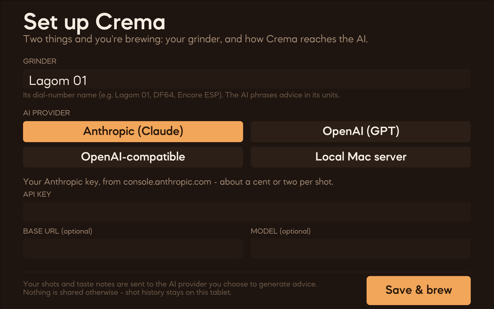

# Crema

A skin for the [Decent DE1](https://decentespresso.com/) espresso machine that turns
every shot into a coaching session. Pull a shot, answer four taps about how it tasted,
and an AI barista reads your pressure/flow/weight curves and tells you exactly what to
change next — grind, dose, yield, temperature, or a whole new profile it can apply for
you in one tap.

It runs **entirely on the tablet**. You bring an API key from any major AI provider;
Crema talks to it directly over your wifi. No companion app, no server, no account.



## What it does

- **Beautiful shot visualization** — a dark, calm home screen with your live shot
  graph, grind number, bean, and ratio front and center.
- **Post-shot coaching** — a ≤10-second questionnaire (taste, body, flow look,
  finish, 1–5 score) feeds the AI along with the actual shot curves.
- **One clear instruction** — advice comes back as a diagnosis plus *one* concrete
  move, phrased in your grinder's own dial numbers. Tap to apply the grind change,
  recipe tweak, or profile switch; Crema updates the machine for you.
- **Custom profiles on demand** — when the fix is structural (bloom longer, decline
  pressure), the AI writes a full D-Flow profile and Crema installs it.
- **Shot history** — every shot, its taste notes, and the advice you got, stored
  locally on the tablet. The AI reads your history so its advice compounds over time.

## Install (5 minutes)

You need: a Decent DE1 with the standard Android tablet, and an API key from one AI
provider (see [Choosing a provider](#choosing-a-provider)).

1. **Get the skin.** Download `Crema.zip` from the
   [latest release](../../releases/latest) (or run `./build.sh` to make it yourself).
2. **Copy it to the tablet.** Unzip so you have a `Crema` folder, then put it in the
   DE1 app's `skins/` directory. The easy way, with the tablet in USB-debugging mode:
   ```bash
   adb push Crema /sdcard/de1plus/skins/Crema
   ```
   (Or copy the folder over with a USB stick / file manager — see [DEPLOY.md](DEPLOY.md).)
3. **Select it.** In the DE1 app: **Settings → App → Skin → Crema**, then restart the app.
4. **Run the setup wizard.** On first launch Crema asks for two things — your grinder
   and your AI provider + key. That's it. Pull a shot.

## Choosing a provider

Crema works with any of these. Your key is stored only on your tablet.

| Provider | You need | Cost per shot | Notes |
|----------|----------|---------------|-------|
| **Anthropic (Claude)** | Key from [console.anthropic.com](https://console.anthropic.com) | ~1–2¢ | Default. Best-tasting advice in testing. |
| **OpenAI (GPT)** | Key from [platform.openai.com](https://platform.openai.com) | ~1–2¢ | |
| **OpenAI-compatible** | A base URL + model | Free if local | Ollama, LM Studio, OpenRouter, etc. Run a model on your own machine for zero cost. |
| **Local Mac server** | The bundled advisor server | Free w/ Claude Max | Advanced. Routes through a `claude` CLI on your Mac so shots bill to a Max subscription instead of per-call. See [DEPLOY.md](DEPLOY.md). |

You can change provider or key any time in **Settings → AI setup**.

## Privacy & cost

- **What leaves the tablet:** when you ask for advice, the shot's curves and your taste
  answers go to the provider you picked, to generate that one response. Nothing else is
  sent, and nothing is sent unless you tap **Get advice**.
- **What stays on the tablet:** your shot history, beans, grinder, and key never leave
  the device (except the key's use in each API call).
- **Cost** is whatever your provider charges per call — roughly a cent or two for the
  hosted options, free if you point Crema at a local model or your own Mac.

## Grinder support

Crema asks for your grinder by name in the wizard and phrases every adjustment in its
units. It was dialed in on a **Lagom 01 (102mm Mizen burrs)** — dial numbers, lower =
finer, 0.2–0.5 is a normal move — but any grinder works; the AI is told your grinder's
name and adapts its advice to it.

## Building & developing

The skin lives in `skin/Crema/`. `build.sh` produces the clean public bundle in `dist/`
(stripping developer state so it boots into first-run defaults).

Development runs against a desktop checkout of
[de1app](https://github.com/decentespresso/de1app) in simulator mode:

```bash
./dev.sh                                   # launch the simulator with Crema
CREMA_SELFTEST=1 CREMA_STANDALONE=1 ./dev.sh   # run the full end-to-end self-test
```

The self-test pulls a simulated shot through questionnaire → AI advice → apply →
history and asserts each stage. See [DEPLOY.md](DEPLOY.md) for the tablet deploy loop
and the optional Mac-server mode.

## License & credits

GPLv3 (see [skin/Crema/LICENSE](skin/Crema/LICENSE)). Crema is a fork of the
MimojaCafe skin for de1app. Splash photo by
[Clint McKoy / Unsplash](https://unsplash.com/@clintmckoy).
